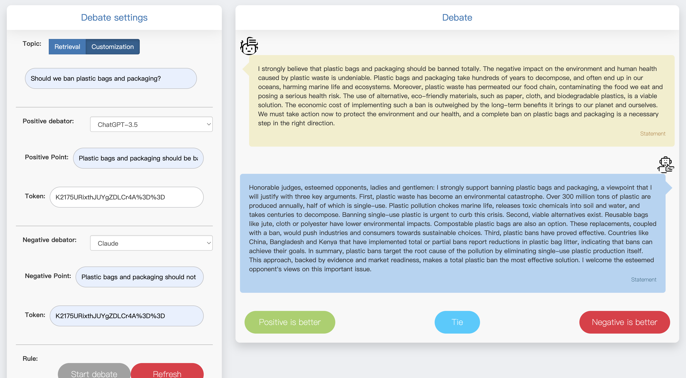

# Debater

This is the Source Code of Paper: Can LLMs Be Good Debaters? An Empirical Evaluation of Critical Thinking Ability in LLMs

## Our Demo

**Link:** \href{http://llm4life.com/debater}
Users can visit our Debater Demo by the above link. We support users in choosing which Large Language Model to hold a positive opinion for a debate topic and which one to have the opposing opinion.

## Debate Topics
The following figure shows the full list of 48 topics debate topics covering 6 categories considered in this work.

## Debate Prompt
The following figure displays the complete prompt used for the LLM debate.

## Interface of Our Demo

### Customization

By choosing ``Customization``, the user can customize his own LLM debate competition.

### Retrieval

By choosing ``Retrieval``, the user can check our debating datasets, which include five LLMs' debating output. 

